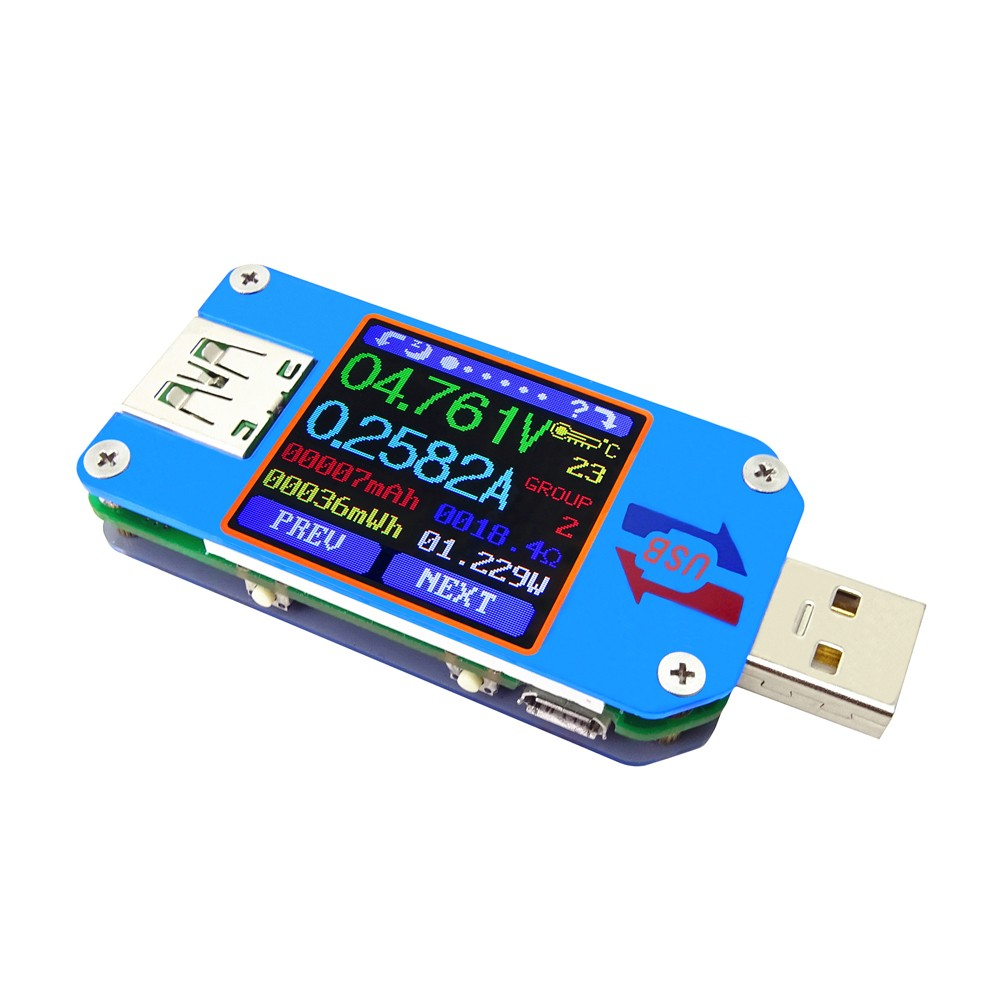

# UM25C

The UM25(C) is an USB Power Meter by RD Tech. It can be found for less then €20 on AliExpress.

The specifications are:
UM25C specifications:

* Display
  * 1.44″ color LCD display
  * 0-5 brightness setting
  * Auto screen off time – 0 to 9 minutes
  * Refresh rate – 2Hz
* Measurement Range & Accuracy
  * Voltage – 4-24.000V ±0.5‰ + 2digits
  * Current –  0-5.0000A ±1‰ + 4 digits
  * Capacity – 0-99999mAh
  * Energy accumulation – 0-99999mWh
  * Load impedance – 0.8Ω-9999.9Ω
  * Time range – 0-99h59min59s
  * Temperature range – -10℃ to 100℃ ±3℃
* Connectivity – Bluetooth (C model)
  * USB – 1x USB male port, 1x USB female port, 1x micro USB port, 1x USB 2.0 type C port
  * Quick charge recognition mode – QC2.0, QC3.0, APPLE 2.4A/2.1A/ 1A/0.5A, Android DCP  for SAMSUNG
  * Misc – 4 buttons to navigate menus, Bluetooth switch
* Dimensions – 71.2mmx30.5mmx12.4mm(UM25C)
  * Weight – 23.74g

It comes with a android and windows application for logging.

This tool is can be used to log the following samples:

* Amperage (A)
* Voltage (V)
* Wattage (W)
* Temperature (C).
* Data group Summed Amp (Ah)
* Data group Summed Watt (Wh)

(more to be added in future)

It outputs the samples to standard out.

This tool does not handle the bluetooth connection, use bluetoothct/blueman for this. You connect to the
`/dev/rfcomm0` device.

You can also use this with an UM25 via a USB to serial cable.

